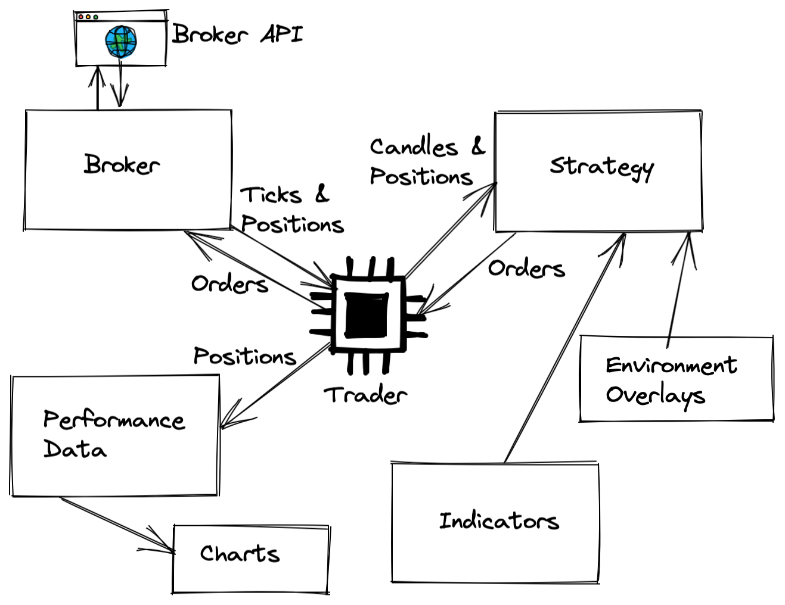
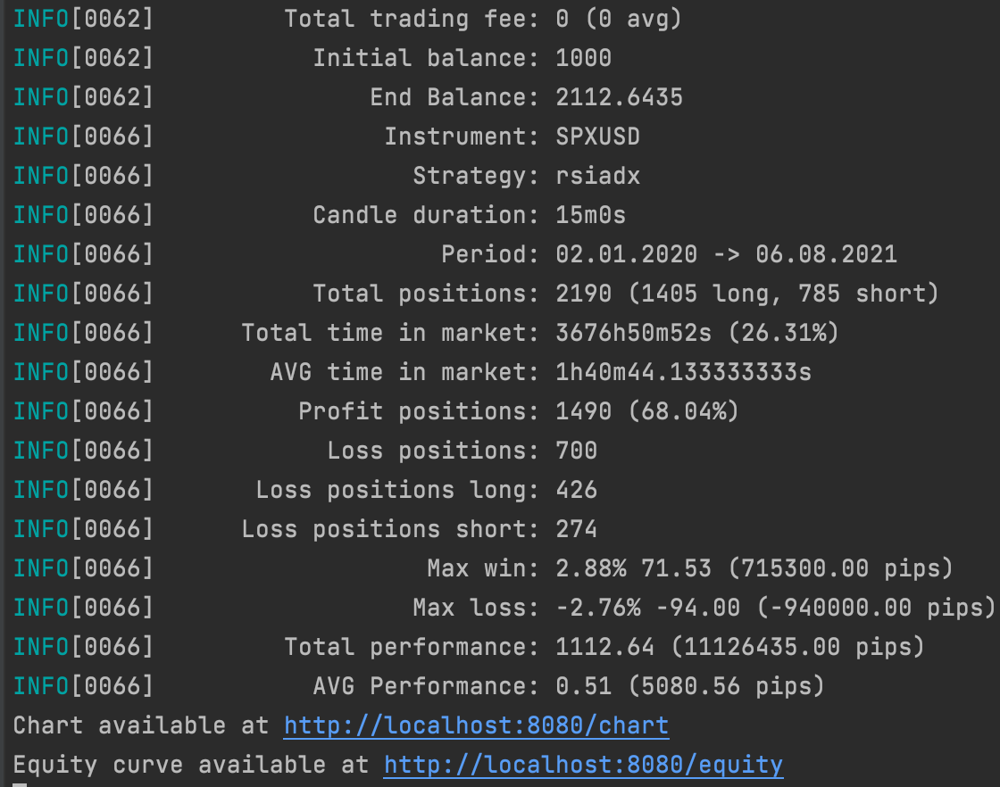
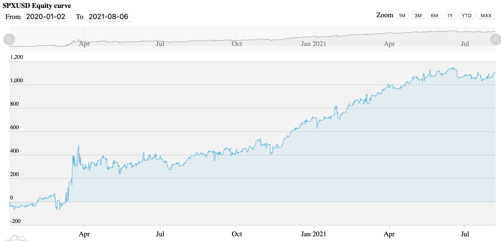

# Automated Trader (at)

[](https://github.com/sklinkert/at/actions/workflows/ci.yaml)

**Purpose**: Framework for building automated trading strategies in three steps:

1. Build your own strategy.
2. Verify it with the backtest module.
3. Connect it to a real broker API to make some money.

Every broker API can be implemented. Works for stocks, forex, cryptocurrencies, etc.

Supported brokers:
- IG.com
- FTX.com (partly)

**Disclaimer**: The developers are not liable for any losses arising from the buy or sell of securities. All included strategies are examples and in no case ready trading systems.

## Installation

```sh
go get github.com/sklinkert/at
```

Example backtesting run:

```shell
INSTRUMENT="CB.ETHUSD" STRATEGY="rsiadx" CANDLE_DURATION=15m YEAR_FROM=2014 YEAR_TO=2022 PRICE_SOURCE="PATTERN_TRADING" go run  -ldflags="-w -s -X main.GitRev=123" ./cmd/backtesting/main.go
```

Uses ETHUSD candles from Coinbase via api.pattern-trading.com

## Overview



## Packages

### broker

Implements concrete broker API.

### trader

The nerve center of the program. It connects the broker with strategies.

### indicator

Implements various trading indicator like Simple Moving Avergae (SMA).

### strategy

Implements various trading strategies.

General flow: 
1. Trader sends OHLC candles to the strategy
2. The strategy feeds indicators and decides what to do. 
3. Trader executes new orders or closes open positions if requested by strategy.

### environment overlays (eo) 

EOs can help to adjust a strategy according to the market volatility in order to reduce risk. E.g. you can change the RSI levels to only buy long if the values goes under 10 instead of 20 because the market is flapping a lot.

## Backtestings

The `backtest` module can apply historical price simulations to your strategy.



It can also print a chart with a beautiful equity curve:



You can use histdata.com prices for backtestings. Check [cmd/import-histdata](https://github.com/sklinkert/at/tree/master/cmd/import-histdata) for more.

## Contribution

Feel free to send PRs. I'm always happy to discuss and improve the code.

## Donations

In case you want to show some love:

- BTC: 3BNnZUfw9qnLVnza9FvWF6n7tEXfWYVVy2
- ETH: 0xd30638F4fD54aeDB458d30504DD1cF2ce7563D36
- XMR: 45At7ezTicAejiLWTAfb28NNXnciH1M67VRrxLRHgfFyimHuPNP7MqbiUgYwwdTzXjbGFwCMsoMoH1Cvv7jPqKKANuaMpjo
